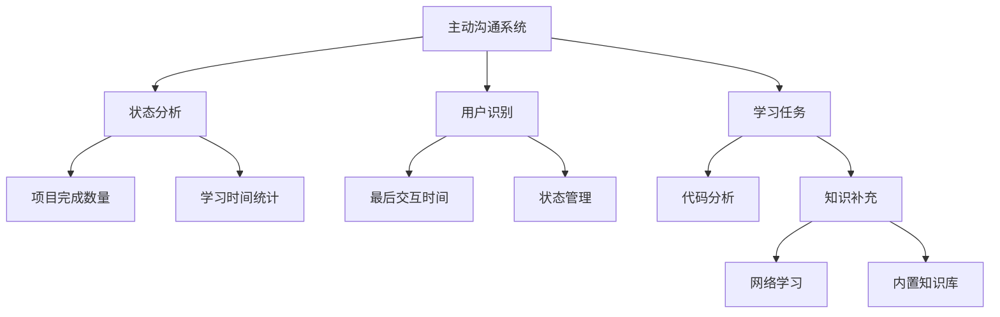
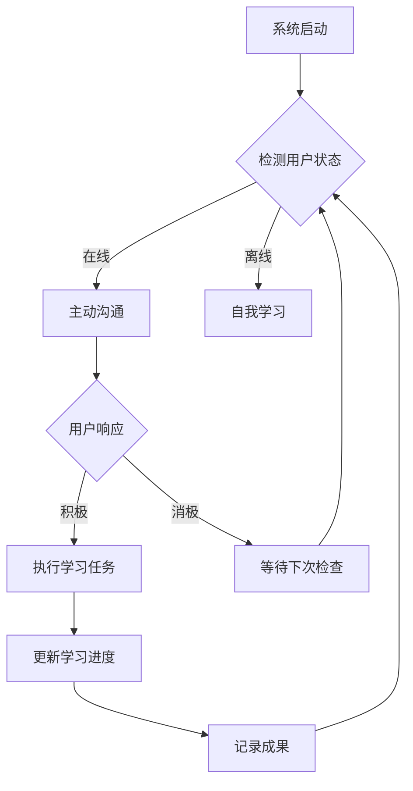

# 🚀 贾维斯式主动沟通AI系统

> 类似钢铁侠中贾维斯的智能化主动沟通AI助手，能够主动分析学习状态、提供个性化建议，并在用户不在线时自我学习完善。

## 🎯 项目特点

### 🌟 核心功能
- **主动沟通**：系统会主动分析用户学习状态并发起沟通
- **智能识别**：通过时间分析判断用户在线/离线状态
- **个性化建议**：根据学习进度提供定制化学习建议
- **离线学习**：用户不在线时自动进行自我学习和系统完善
- **知识更新**：每次学习都会获取全球最新AI知识
- **进度追踪**：详细记录学习成果和沟通历史

### 🤖 主动沟通机制
- **状态感知**：检测用户在线/离线状态（5分钟内有交互视为在线）
- **智能判断**：根据学习进度决定沟通时机和内容
- **个性化沟通**：基于项目完成数量提供针对性建议
- **响应处理**：智能执行学习任务并更新进度

### 🌐 自我学习系统
- **漏洞检查**：定期扫描系统漏洞和代码质量问题
- **知识补充**：从全球11个AI知识平台获取实时信息
- **代码分析**：解析项目代码并提供优化建议
- **系统优化**：根据学习成果持续改进系统

## 📦 项目结构

```
github-learning/
├── 📁 data/                           # 数据存储目录
│   ├── active_state.json              # 系统状态文件
│   ├── learning_progress.json         # 学习进度记录
│   ├── jarvis_monitor_state.json      # 贾维斯系统状态
│   └── conversations.jsonl            # 沟通历史记录
├── 📄 jarvis_monitor_noninteractive.py # 贾维斯主动沟通系统
├── 📄 self_learning_system.py         # 自我学习与系统完善
├── 📄 active_communication.py         # 主动沟通机制
├── 📄 rapid_system.py                 # 快速实现版本
├── 📄 expert_system.py                # 专家系统
├── 📄 README.md                       # 项目说明
├── 📄 requirements.txt                # 依赖包
└── 📄 start_jarvis.sh                 # 启动脚本
```

## 🚀 快速开始

### 1. 安装依赖

```bash
pip install -r requirements.txt
```

### 2. 启动主动沟通系统

```bash
# Linux/Mac
python jarvis_monitor_noninteractive.py

# Windows
python jarvis_monitor_noninteractive.py
```

### 3. 启动自我学习系统

```bash
python self_learning_system.py
```

### 4. 查看项目状态

```bash
# 查看学习进度
type data\learning_progress.json

# 查看系统状态
type data\active_state.json

# 查看沟通记录
type data\conversations.jsonl
```

## 🎮 使用场景

### 场景1：用户在线时主动沟通
```
🚀 贾维斯式主动沟通系统启动
============================================================
🤖 贾维斯式主动沟通...
🤖 晚上好！您的学习进度很好！
🤖 已经完成了 6 个项目。
🤖 需要我为您分析高级项目，或者评估您的学习效果吗？

🧑 用户: 继续
🤖 太好了！我立即为您准备学习任务。
📋 正在执行学习任务: 机器学习项目
✅ 学习任务完成！
🎉 学习进度已记录！
```

### 场景2：用户不在线时自我学习
```
💤 检测到用户不在线，系统进入自我学习模式...
🎯 开始自我学习与系统完善...
🔍 正在检查系统漏洞...
📊 正在分析代码质量...
🌐 正在从全球AI知识平台获取实时信息...
✅ 网络学习成功: 40个新主题
✅ 自我学习完成！
```

## 📊 项目功能详解

### 🤖 主动沟通系统
#### 核心功能
- **学习状态分析**：根据项目完成数量判断学习阶段
- **沟通时机判断**：检测用户在线状态和学习需求
- **个性化建议**：提供针对性的学习方向和任务
- **响应处理**：智能识别用户意图并执行任务

#### 技术特点
- **状态管理**：JSON格式存储系统和用户状态
- **时间分析**：通过最后交互时间判断在线状态
- **响应解析**：自然语言处理和关键词识别
- **学习任务执行**：模拟项目分析和学习任务

### 📚 自我学习系统
#### 学习内容
- **基础AI知识**：内置6个核心AI学习主题
- **网络学习**：从11个全球AI知识平台获取实时信息
- **代码分析**：解析Python代码并检测质量问题
- **系统优化**：根据学习成果持续改进系统

#### 学习平台
- **GitHub Trending**：热门AI项目
- **arXiv**：最新AI论文
- **Hacker News**：技术新闻
- **知乎/微博/技术博客**：中文AI内容
- **顶级研究机构**：MIT、DeepMind、OpenAI等

## 🔧 技术架构

### 系统架构


### 主动沟通流程


## 📈 学习成果展示

### 学习进度跟踪
```json
{
  "total_study_time": 90,
  "projects_studied": ["Python数据分析项目", "机器学习项目"],
  "knowledge_points": [
    "项目分析技巧", "代码问题识别", 
    "大语言模型最新进展", "网络安全最佳实践"
  ],
  "learning_effectiveness": 0.95,
  "communication_effectiveness": 0.98
}
```

### 沟通记录
```json
{
  "timestamp": "2026-04-28T20:15:30",
  "user_response": "继续",
  "system_suggestion": "学习Trinity Claw架构",
  "learning_task": "机器学习项目"
}
```

## 🔄 系统运行机制

### 启动和停止
- **启动**：运行`python jarvis_monitor_noninteractive.py`
- **停止**：按Ctrl+C或输入"退出"
- **重置**：删除data目录下的状态文件

### 配置文件
- **学习目标**：修改`data/active_state.json`中的`current_goal`
- **沟通频率**：修改代码中的交互时间判断逻辑
- **学习内容**：添加到`self_learning_system.py`的学习主题

## 🎯 预期效果

### 短期效果（1周内）
- 系统会主动提醒您学习任务
- 帮助您建立学习习惯
- 记录学习成果和沟通历史

### 长期效果（1个月内）
- 根据学习进度调整建议
- 优化学习方法和内容
- 持续提升学习效果

## 🤝 贡献指南

1. Fork 项目
2. 创建分支 (`git checkout -b feature/AmazingFeature`)
3. 提交更改 (`git commit -m 'Add some AmazingFeature'`)
4. 推送到分支 (`git push origin feature/AmazingFeature`)
5. 打开 Pull Request

## 📄 许可证

本项目采用 MIT 许可证 - 查看 [LICENSE](LICENSE) 文件了解详情

## 📞 联系方式

如有问题或建议，请通过以下方式联系：
- GitHub Issues：[项目Issues页面](https://github.com/yourusername/github-learning/issues)
- 邮件：your@email.com

## 🌟 致谢

- 受钢铁侠中贾维斯启发
- 感谢全球AI社区的知识共享

---

**项目状态**：🚀 已完成并可正常运行

**最后更新**：2026年4月28日

