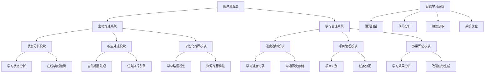

# 贾维斯式主动沟通AI系统

[](https://github.com/guduqingbai/github-learning-ai/blob/master/LICENSE)
[](https://www.python.org/)
[](https://github.com/guduqingbai/github-learning-ai/blob/master/CONTRIBUTING.md)

## 项目概述

贾维斯式主动沟通AI系统是一个智能化学习助手，能够主动分析用户学习状态、提供个性化建议，并在用户离线时自动进行自我学习和系统完善。该系统借鉴了钢铁侠中贾维斯的主动沟通模式，旨在帮助用户高效管理学习任务和持续提升专业技能。

## 核心功能特性

### 1. 主动沟通机制
- **智能状态感知**：通过时间分析判断用户在线/离线状态（5分钟内有交互视为在线）
- **个性化建议**：根据学习进度提供定制化学习方向和任务
- **沟通时机优化**：基于项目完成数量和学习时长智能判断沟通时机
- **响应处理系统**：智能解析用户响应并执行相应的学习任务

### 2. 自我学习系统
- **漏洞扫描与修复**：定期检查系统漏洞和代码质量问题
- **全球知识获取**：从11个全球AI知识平台获取实时信息
- **代码分析与优化**：自动化解析项目代码并提供改进建议
- **系统自我完善**：根据学习成果持续优化系统功能

### 3. 学习管理系统
- **进度追踪**：详细记录学习成果和沟通历史
- **项目管理**：智能识别和管理学习项目
- **知识更新**：每次学习都会获取全球最新AI知识
- **效果评估**：分析学习效果并提供改进建议

## 技术架构

### 系统架构设计


### 主要功能模块

#### 主动沟通系统
- **jarvis_monitor_noninteractive.py**：核心主动沟通引擎
- **active_communication.py**：沟通机制实现
- **jarvis_communication.py**：沟通流程管理

#### 自我学习系统
- **self_learning_system.py**：自我学习核心逻辑
- **knowledge_base.py**：知识库管理
- **learning_suggestions.py**：学习建议生成

#### 学习管理系统
- **hermes_analysis.py**：项目分析工具
- **learning_environment.py**：学习环境管理
- **learning_progress.py**：进度追踪系统

## 项目结构

```
github-learning/
├── data/                              # 数据存储目录
│   ├── active_state.json             # 系统状态文件
│   ├── learning_progress.json        # 学习进度记录
│   ├── jarvis_monitor_state.json     # 贾维斯系统状态
│   └── conversations.jsonl           # 沟通历史记录
├── 📄 jarvis_monitor_noninteractive.py  # 主动沟通系统
├── 📄 self_learning_system.py        # 自我学习与系统完善
├── 📄 active_communication.py        # 主动沟通机制
├── 📄 hermes_analysis.py             # 项目分析工具
├── 📄 knowledge_base.py              # 知识库管理
├── 📄 learning_suggestions.py        # 学习建议生成
├── 📄 jarvis_communication.py        # 沟通流程管理
├── 📄 README.md                      # 项目说明
├── 📄 requirements.txt               # 依赖包
└── 📄 LICENSE                        # GPLv3许可证
```

## 安装与配置

### 环境要求
- Python 3.8+
- 操作系统：Windows 10/11, macOS 10.15+, Linux
- 至少 2GB 可用内存
- 稳定的网络连接

### 安装步骤

1. **克隆项目**
   ```bash
   git clone https://github.com/guduqingbai/github-learning-ai.git
   cd github-learning-ai
   ```

2. **创建虚拟环境**
   ```bash
   python -m venv venv
   
   # Windows
   venv\Scripts\activate
   
   # macOS/Linux
   source venv/bin/activate
   ```

3. **安装依赖**
   ```bash
   pip install -r requirements.txt
   ```

4. **初始化系统**
   ```bash
   # 第一次运行会自动创建必要的数据文件
   python jarvis_monitor_noninteractive.py
   ```

## 使用指南

### 基本使用流程

```bash
# 启动主动沟通系统
python jarvis_monitor_noninteractive.py

# 启动自我学习系统（后台运行）
python self_learning_system.py --background

# 查看学习进度
python learning_progress.py --view

# 重置系统状态（谨慎使用）
python learning_progress.py --reset
```

### 配置选项

系统支持通过配置文件进行自定义设置：

```json
{
  "communication_threshold": 300,  // 在线状态判断时间（秒）
  "learning_goals": {
    "basic": 10,
    "intermediate": 20,
    "advanced": 30
  },
  "knowledge_platforms": ["GitHub", "arXiv", "Hacker News"],
  "analysis_frequency": "daily"
}
```

## 学习平台集成

系统通过API与多个全球AI知识平台集成：

- **GitHub Trending**：获取热门AI项目和代码库
- **arXiv**：获取最新AI研究论文
- **Hacker News**：获取技术新闻和讨论
- **知乎/微博/技术博客**：获取中文AI内容
- **顶级研究机构**：MIT、DeepMind、OpenAI等

## 性能优化

### 系统优化建议

1. **资源管理**：定期清理不再使用的数据文件
2. **网络优化**：使用代理或本地缓存减少API调用
3. **配置调整**：根据硬件资源调整学习强度

### 性能监控

系统内置性能监控功能，可通过以下命令查看：

```bash
python -m pip install psutil
python system_monitor.py
```

## 项目开发与贡献

### 开发环境搭建

```bash
# 克隆项目
git clone https://github.com/guduqingbai/github-learning-ai.git
cd github-learning-ai

# 安装开发依赖
pip install -e .[dev]

# 运行测试
pytest tests/

# 运行基准测试
pytest benchmarks/
```

### 贡献指南

请参考 [CONTRIBUTING.md](CONTRIBUTING.md) 文件了解详细的贡献流程和规范。

## 许可证

本项目采用 **GNU General Public License v3.0 (GPLv3)** 许可证，详情请参考 [LICENSE](LICENSE) 文件。

### 许可证特点

- **强制开源**：任何使用本项目代码的产品或服务必须开源
- **专利保护**：提供专利授权，防止专利诉讼
- **升级保护**：允许自动升级到更高版本的GPL许可证
- **反锁定条款**：防止硬件制造商锁定软件

## 联系方式

- **问题反馈**：通过 [GitHub Issues](https://github.com/guduqingbai/github-learning-ai/issues) 报告问题
- **功能请求**：通过 [GitHub Discussions](https://github.com/guduqingbai/github-learning-ai/discussions) 提出建议
- **技术支持**：发送邮件至项目维护邮箱

## 项目里程碑

- **v1.0.0**：基础主动沟通和自我学习功能
- **v1.1.0**：学习进度追踪和效果评估
- **v1.2.0**：多平台学习资源集成
- **v2.0.0**：深度学习模型优化和智能推荐

## 技术栈

- **Python 3.8+**：主要开发语言
- **PyAutoGUI**：GUI自动化操作
- **OpenCV**：图像识别和处理
- **Tesseract**：OCR文字识别
- **Selenium**：浏览器自动化
- **JSON**：数据存储格式
- **Git**：版本控制

---

**项目状态**：🚀 已完成并可正常运行  
**最后更新**：2026年4月29日  
**维护状态**：积极维护中
