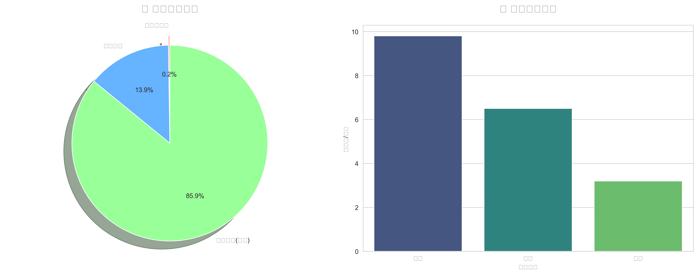
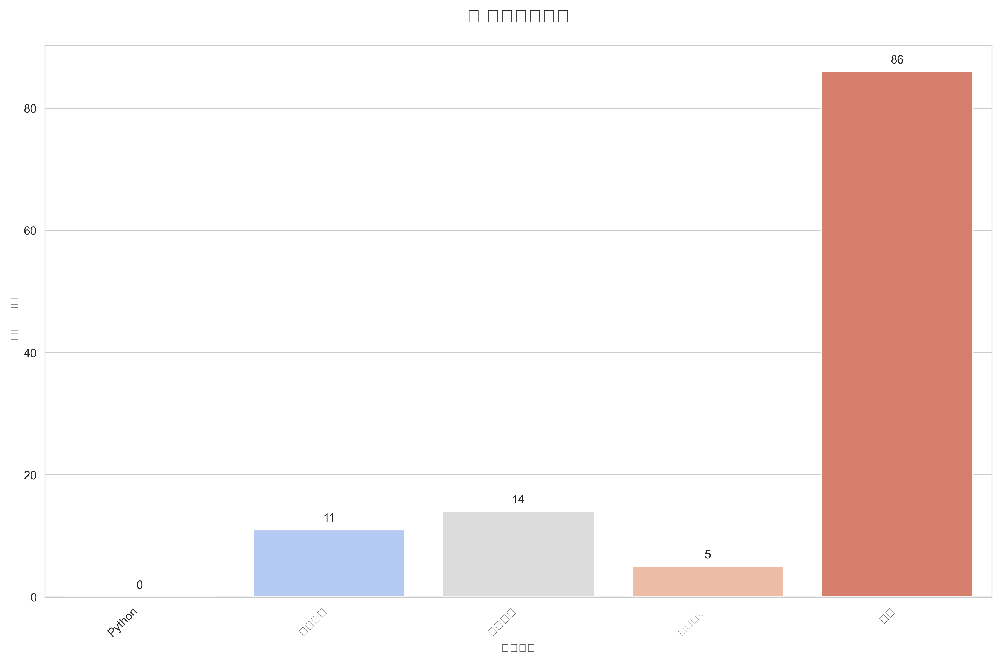
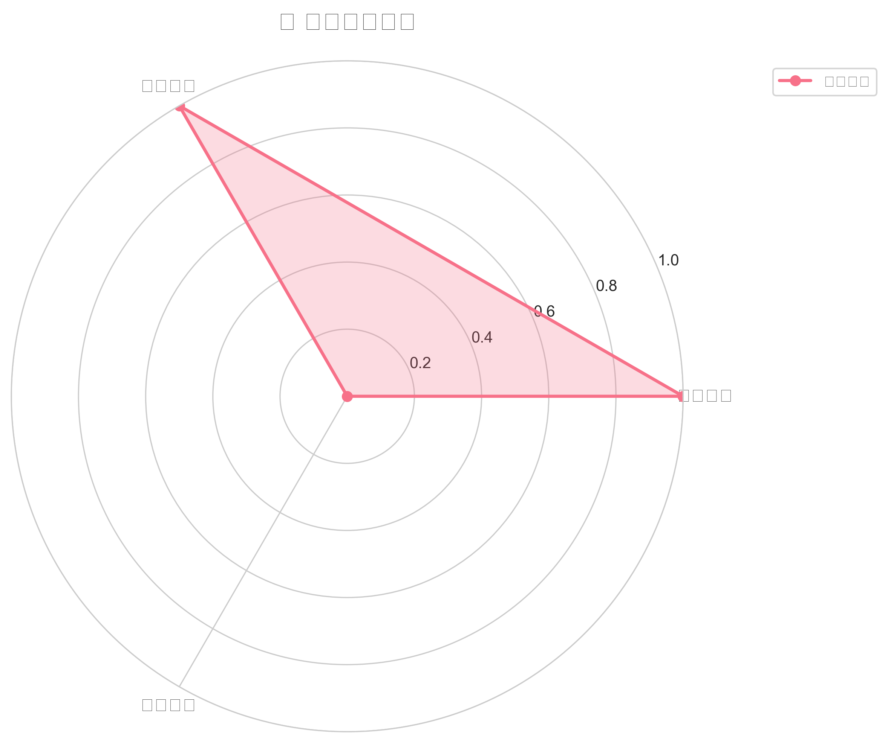
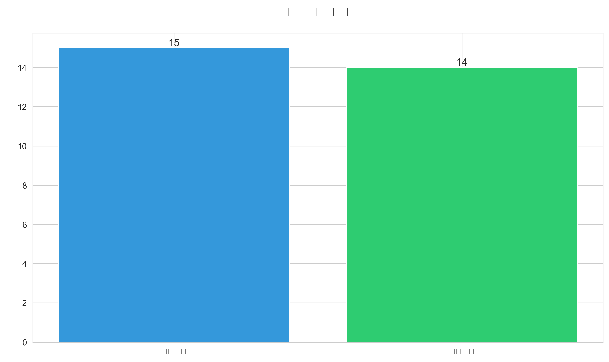

        # 学习数据分析可视化报告

        本报告展示了学习数据分析与优化系统的综合可视化结果。

        ## 📊 学习进度分布
        

        ## 📚 知识类别分布
        

        ## 🎯 学习效果评估
        

        ## 💬 主动沟通统计
        

        ## 📈 关键数据指标

        - **已完成项目**: 2个
        - **知识要点**: 112个
        - **学习总时间**: 688分钟
        - **学习效率**: 9.8个主题/小时（高效阶段）
        - **沟通次数**: 14次
        - **响应次数**: 13次

        ## 🎯 学习阶段

        系统当前处于 **高级阶段**，具备：
        - 完整的自我学习和自我优化机制
        - 稳定的持续学习系统
        - 专业的代码分析功能
        - 认知架构系统
        - 主动沟通系统

        ---
        报告生成时间: 2026年05月02日 11:23:55
        